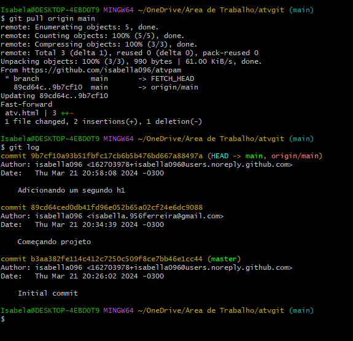

# atvpam

<h1>Eduardo Borges Brandão e Isabella Ferreira Alves</h1>
  

Criando um novo repositório.

  

Após abrir o projeto no Git Bash, iniciamos o repositório com o comando "git init".

  

Iniciando a estrutura básica do Git Bash, onde declaramos o nome de usuário e o email utilizados no cadastro do GitHub.

  

Configurando o repositório, onde utilizamos o comando "git remote add origin" para associar o repositório ao servidor, e o comando "git pull" para puxar arquivos e mesclar alterações.

  

Utilizando o "git checkout" para mudar de branch.

  

Utilizando o "git add" para adicionar um commit junto do comando "git commit", para marcar um ponto de referência no arquivo.

  

Com o "git push" enviamos as alterações para o servidor.

  

Mostrando arquivo no repositório.

  

  

Alterando o arquivo e fazendo um commit no repositório.

  

Conm o "git pull" puxamos as alterações do repositório para o arquivo local e utilizamos o "git log" para ver os commits feitos.

  

Monstrando a junção das alterações no projeto.

